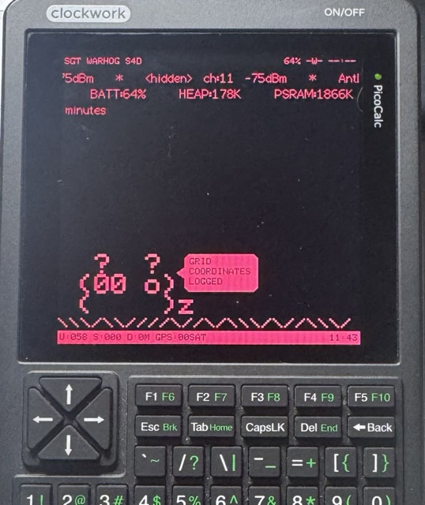

# PORKOCALC v0.3

### PorkChop port for the ClockworkPi PicoCalc with a Waveshare ESP32-S3-Pico core
### BETA BUILD FOR TESTERS

<p align="center">
  
</p>

This is pre-release software for experienced users to test. The following are not yet thoroughly tested:

1: GPS accuracy. I have not taken it out driving yet.
2: Any offensive modes. I have not taken them to a closed location yet. These modes are inherited from M5PorkChop and are not the focus. Porkocalc is a recon device, not an attack device. It never auto-boots into an attack mode.
3: Validity of the WARHOG logs.

All of this comes with no warranty, especially those untested bits. See [DISCLAIMERS.md](DISCLAIMERS.md) before testing any modes. Found a bug? Open a GitHub issue with your board revision and a serial log. Don't be a skid.

---

## About Porkocalc

**[M5PorkChop](https://github.com/0ct0sec/M5PORKCHOP) running on a [ClockworkPi PicoCalc](https://www.clockworkpi.com/picocalc) with a [Waveshare ESP32-S3-Pico](https://www.waveshare.com/wiki/ESP32-S3-Pico).**

Porkocalc is a **port**, not a rewrite. The pig, the WiFi/BLE recon, the wardriving, the spectrum
analyzer - all of that adapted from **0ct0's M5PorkChop** (please [star the original](https://github.com/0ct0sec/M5PORKCHOP)).
What Porkocalc adds is a board target that runs it on the PicoCalc's 320x320 screen and 67-key
keyboard via the [`picocalc-esp32`](https://github.com/thoughtfix/picocalc-esp32) driver + Cardputer
compatibility layer. It is a **recon device, not an attack device** - it never auto-boots into an
attack mode.

> New to this? The PicoCalc is a Raspberry-Pi-Pico-socket handheld. Swap the Pico for a Waveshare
> ESP32-S3-Pico (no wiring changes) and flash this firmware.

## What's different on the PicoCalc

- Full-screen 320x320 layout: status/detection tickers up top, the pig anchored at the bottom, a
  fullscreen spectrum + downward waterfall.
- OPTIONAL GPS on the external side header (attach/remove without opening the case). 
- Recon-only: attack modes never auto-start.

## Build & flash

Porkocalc keeps the Cardputer build **and** adds a PicoCalc build; pick the env:

```sh
# PicoCalc (Porkocalc) - needs the picocalc-esp32 dependency, fetched automatically
pio run -e picocalc -t upload

# original M5Cardputer target (unchanged)
pio run -e m5cardputer -t upload
```

Flash through the **ESP32-S3-Pico's own USB-C**, not the PicoCalc's. The `picocalc-esp32` library
is pulled in automatically by PlatformIO (see `platformio.ini`). To develop both repos side by
side, point that dependency at a local checkout - details in `platformio.ini`.

- **Known issues & TODO:** [KNOWN_ISSUES.md](KNOWN_ISSUES.md) (GPS field test, battery gauge - the honest list)
- **Credits:** [CREDITS.md](CREDITS.md). **License:** MIT ([LICENSE](LICENSE)), same as upstream
- **The driver library:** [picocalc-esp32](https://github.com/thoughtfix/picocalc-esp32)

---

*Everything below is 0ct0's original M5PorkChop README, preserved as-is.*

---

```
                    Volume Zero, Issue 3, Phile 1 of 1

                          M5PORKCHOP README
                          v0.1.8b-PSTH

                            ^__^
                            (oo)\_______
                            (__)\       )\/\
                                ||----w |
                                ||     ||
                (yes that's a cow. the pig ate the pig art budget.)
                (the horse was unavailable for comment.)


                67% of skids skip READMEs.
                100% of those skids report bugs we documented.
                the horse thinks this is valid.


                         TABLE OF CONTENTS

    1. WHAT THE HELL IS THIS
    2. MODES (what the pig does)
    3. THE PIGLET (mood, avatar, weather)
    4. THE FORBIDDEN CHEESE ECONOMY (XP, ranks, trophies)
    5. CLOUD HOOKUPS (WiGLE / WPA-SEC)
    6. PIGSYNC (son of a pig)
    7. THE MENUS
    8. CONTROLS
    9. SD CARD LAYOUT
    10. BUILDING
    11. LEGAL
    12. TROUBLESHOOTING (the confessional)
    13. GREETZ

    (pro tip: CTRL+F "horse" for enlightenment.
     we counted them. the horse counted more.
     one of us is wrong. both of us are the barn.)

```
```
+==============================================================+
|                                                              |
| [O] OINK MODE     - yoink handshakes. question ethics.       |
| [D] DO NO HAM     - zero TX. passive recon. zen pig.         |
| [W] WARHOG        - GPS wardriving. legs required.           |
| [H] SPECTRUM      - RF analysis. client hunting. fangs.      |
| [B] PIGGY BLUES   - BLE spam. YOU DIED. in that order.       |
| [F] FILE XFER     - web UI. civilization achieved.           |
| [*] BACON         - fake beacons. via MENU. worth the trip.  |
|                                                              |
| [1] PIG DEMANDS   - session challenges. three trials.        |
| [2] PIGSYNC       - the prodigal son answers the phone.      |
|                                                              |
| REMEMBER:                                                    |
| 1. only attack what you own or have written permission to    |
| 2. "because it can" is not a legal defense                   |
| 3. the pig watches. the law judges. know the difference.     |
|                                                              |
+==============================================================+
```
```

--[ 1 - WHAT THE HELL IS THIS

    three questions every operator asks:
    1. "what does it do?"
    2. "is it legal?"
    3. "why does the pig look disappointed in me?"


----[ 1.1 - THE ELEVATOR PITCH

    PORKCHOP runs on M5Cardputer (ESP32-S3, 240MHz, 8MB flash).
    it turns a pocket keyboard into a WiFi pentesting companion with:

    - promiscuous mode packet capture and EAPOL extraction
    - GPS wardriving with WiGLE v1.6 export
    - 2.4GHz spectrum analysis with client tracking
    - BLE notification spam (Apple/Android/Samsung/Windows)
    - beacon injection with vendor IE fingerprinting
    - device-to-device sync via ESP-NOW (PigSync)
    - a personality system with opinions about your choices

    it's a learning tool for WiFi security research.
    the difference between tool and weapon is the hand holding it. 
    wink. wink.


----[ 1.2 - THE LINEUP (what you're getting into)

    words are cheap. pixels are evidence.

    THE PIG IN THE FLESH:

    
    *the pigs. awake. judging. 240x135 pixels of unsolicited opinions.*

    THE HARDWARE NAKED:

    
    *cardputer ADV + CapLoRa868. GPS + LoRa on a keyboard.*
    *smaller than your phone. more opinions than your family.*

    
    *the full loadout. everything the pig needs to judge your neighborhood.*

    (photos missing? we're working on it. the pig doesn't pose for free.
     the horse refused the photoshoot entirely. barn lighting was wrong.)


----[ 1.3 - HARDWARE SPECS

    M5Cardputer (M5Stack StampS3):
        (EAPOL has M1, M2, M3, M4. the hardware is M5.
         the fifth message. the one the protocol never sent.
         we are the frame after the handshake.)
        - ESP32-S3FN8: 240MHz dual-core, 512KB SRAM, 8MB flash
        - NO PSRAM (~300KB usable heap. every byte matters.)
        - 240x135 IPS LCD (ST7789V2)
        - QWERTY keyboard (56 keys)
        - SD card slot (FAT32, shared SPI bus with CapLoRa)
        - NeoPixel LED (GPIO 21)
        - USB-C (power + serial)

    Optional:
        - GPS module: AT6668/ATGM336H (Grove port G1/G2 or CapLoRa)
        - CapLoRa868 module (G15/G13 GPS, SX1262 LoRa shares SD SPI)
        - Cardputer ADV: BMI270 IMU enables dial mode in Spectrum
        - your legs, for wardriving. no judgment on wheels.

    GET THE HARDWARE (the part where we sell out):

        look. we're going to be transparent here.
        these are affiliate links. we get a cut.
        you get a pig. capitalism works (sometimes).

        the pig doesn't mass-produce itself.
        the pig needs a body. the body needs a store.
        the store needs a link. the link needs a click.
        you see where this is going.

        M5Stack Cardputer ADV (the pig's body):
        https://shop.m5stack.com/products/m5stack-cardputer-adv-version-esp32-s3/?ref=xqezhcga

        CapLoRa 1262 (GPS + LoRa module, the pig's sense of direction):
        https://shop.m5stack.com/products/cap-lora-1262-for-cardputer-adv-sx1262-atgm336h?ref=xqezhcga

        buying through these links funds:
        1. coffee (which becomes code)
        2. code (which becomes bugs)
        3. bugs (which become trauma)
        4. trauma (which becomes coffee)
        5. the circle continues. you're an investor now.

        not buying? also valid. the pig judges purchases,
        not people. clone it, build it, source it however.
        open source means open source.

        but if you DO click... the pig remembers its friends.


----[ 1.4 - ARCHITECTURE (for the silicon gourmets)

    THE CORE:
    cooperative main loop. porkchop.update() (SFX ticks inside),
    Display::update(), Mood::update(). the pig's vital organs.
    single PorkchopMode enum, 24 states. one mode lives. the others wait.
    the pig is a finite state machine with infinite opinions.
    the horse is a barn with load-bearing feelings.

    THE MEMORY WAR:
    no PSRAM means ~300KB internal SRAM for everything.
    TLS needs ~35KB contiguous (kMinContigForTls in heap_policy.h).
    WiFi driver init needs ~70KB (why preInitWiFiDriverEarly() exists).
    the heap fragments like your relationship with sleep.

    HEAP CONDITIONING:
    boot runs a 5-phase ritual: frag blocks (50x1KB), struct blocks
    (20x3KB), TLS test allocs (26KB, 32KB, 40KB). exploits ESP-IDF's
    TLSF allocator for O(1) coalescing. the result: a clean brain
    for TLS handshakes. percussive maintenance for memory.
    the horse calls this "barn defragmentation."
    the barn denies having a defragmentation problem.
    the barn is the horse. denial is structural.

    HEAP MONITORING:
    heap_health.h samples every 1s. auto-triggers conditioning when
    health drops below 65%, clears when it recovers above 75%.
    adaptive cooldown: 15-60s between rounds (scales with heap state).
    the heart bar at the bottom of the screen is heap health.
    100% = clean. 0% = swiss cheese. the pig's blood pressure, basically.

    THE EVENT BUS:
    max 32 queued events, 16 processed per update tick.
    MODE_CHANGE, ML_RESULT, GPS_FIX, GPS_LOST,
    HANDSHAKE_CAPTURED, NETWORK_FOUND, DEAUTH_SENT,
    ROGUE_AP_DETECTED, OTA_AVAILABLE, LOW_BATTERY.
    the pig processes feelings through a state machine.
    the horse processes feelings through a k-hole.

    DUAL-CORE PATTERN:
    WiFi promiscuous callbacks run on core 1 (WiFi task).
    they CANNOT allocate memory or call Serial. instead:
    callback sets volatile flags + writes to static pools.
    main loop on core 0 checks flags and processes safely.
    this is the deferred event pattern. it keeps the WDT happy.
    WDT = Watchdog Timer. also What Did (The pig) Think.

    STATIC POOLS:
    OINK pre-allocates PendingHandshakeFrame pendingHsPool[4]
    (~13KB in BSS). permanent. std::atomic indices for lock-free
    producer/consumer between WiFi task and main loop.
    the pig pays rent on memory it might never use.

    NetworkRecon:
    shared background scanning service. OINK, DONOHAM, SPECTRUM,
    and WARHOG all consume the same getNetworks() vector.
    spinlock mutex with RAII CriticalSection wrapper.
    channel hop order: 1, 6, 11, then 2-5, 7-10, 12-13.
    max 200 networks tracked. the pig has limits.
    (200 is generous. the heap disagrees.)

    BOOT GUARD:
    RTC memory tracks rapid reboots. 3 in 60 seconds = force IDLE.
    crash loops get the nuclear option. the pig learns from pain.
    the horse calls this progress.

------------------------------------------------------------------------

--[ 2 - MODES (what the pig does)

    one keypress from IDLE. zero menus. zero friction.
    each mode changes the pig's vocabulary.
    this is not a bug. this is character development.


----[ 2.1 - OINK MODE (active hunt) [O]

    the pig goes rowdy. opinions about APs become actionable.
    snout to the wire. tusks out.

    CAPABILITIES:
        - channel hop across 2.4GHz (13 channels, adaptive timing)
        - promiscuous mode 802.11 frame capture
        - EAPOL handshake extraction (M1-M4, validates sequence)
        - PMKID extraction from RSN IE in M1 frames
          (the AP just volunteers it. trust issues are real.)
        - deauth (Reason 7) + disassoc (Reason 8) with jitter
          (randomized inter-frame timing. less predictable to WIDS.
           the pig appreciates subtlety. the timing appreciates rank.)
        - PMF detection: Protected Management Frames networks
          get marked immune. the pig respects armor.
        - targeted client deauth (up to 20 clients per network)
        - broadcast disassoc alongside broadcast deauth
          (some devices ignore deauth but fold to disassoc.
           the pig covers all the exits.)
        - hashcat 22000 export (.22000 files, zero preprocessing)
        - PCAP export with radiotap headers (Wireshark-ready)
        - auto-cooldown on targets (no spam, surgical precision)
        - smart target selection (priority scoring: RSSI, activity,
          client count, beacon stability)

    LOCK-ON DISPLAY:
        target SSID (or <HIDDEN>), client count,
        capture progress (M1/M2/M3/M4 indicators),
        quality score, beacon interval EMA.

    BOAR BROS: press [B] to whitelist a network.
        bros get observed, not attacked. the pig has honor.
        manage in SYSTEM > BOARBROS. max 50 networks.
        zero heap allocation (fixed array in BSS).

    SEAMLESS TOGGLE: press [D] to flip into DO NO HAM.
        same radio state. different conscience.


----[ 2.2 - DO NO HAM (passive recon) [D]

    the pig goes zen. zero transmissions. pure observation.
    the ether provides to those who wait.

    CAPABILITIES:
        - promiscuous receive ONLY (zero TX, zero deauth)
        - adaptive channel timing with state machine:
            HOPPING    = scanning all channels (250ms primary, 150ms secondary)
            DWELLING   = found activity, staying for SSID backfill (300ms)
            HUNTING    = partial EAPOL detected, extended dwell (600ms)
            IDLE_SWEEP = dead channels, fast sweep (120ms minimum)
        - channel stats track beacons/EAPOL per channel
          primary channels (1, 6, 11) get longer dwell times
          dead channels (zero beacons across full cycle) trigger IDLE_SWEEP
        - passive PMKID catches (APs volunteer PMKIDs in M1 frames.
          you just have to be patient enough to hear them confess.)
        - passive handshake capture from natural reconnects
        - incomplete handshake tracking (shows missing frames,
          max 20 tracked, 60s age-out, automatic revisit)
        - some achievements here reward patience over violence.
          the rarest catches go to the stillest hunters.

    press [O] to flip back to OINK.
    the pig remembers which side you chose.


----[ 2.3 - SGT WARHOG (wardriving) [W]

    the pig goes tactical. salutes things.
    starts talking about sectors and objectives.

    CAPABILITIES:
        - continuous AP scanning with GPS correlation
        - WiGLE CSV v1.6 export (WigleWifi-1.6 format)
        - internal CSV with extended fields
        - dedup bloom filter (no duplicate entries.
          the pig doesn't double-count. the pig has integrity.)
        - distance tracking for XP (your legs = XP)
        - capture marking for bounty system
        - file rotation for session management
        - direct-to-disk writes (no entries[] accumulation.
          RAM is for living, not for hoarding.)

    BOUNTY SYSTEM: wardriven networks become targets for
    PigSync. your s3rloin companion can hunt what you found.
    max 15 bounty BSSIDs per sync payload.
    manage in LOOT > BOUNTY.

    FILES: /m5porkchop/wardriving/*.wigle.csv

    no GPS? pig still logs. coordinates read 0.000000.
    technically accurate. spiritually devastating.
    get GPS. the pig deserves latitude.


----[ 2.4 - HOG ON SPECTRUM (RF analysis) [H]

    pure concentration. the pig does math now.

    CAPABILITIES:
        - 2.4GHz spectrum visualization (channels 1-13)
        - gaussian lobes per network (RSSI = height)
        - noise floor animation at baseline
        - waterfall display (historical spectrum, push per update)
        - VULN indicator (WEP/OPEN networks. still? in the wild? respect.)
        - BRO indicator (networks in boar_bros.txt)
        - filter modes: ALL / VULN / SOFT (no PMF) / HIDDEN
        - render snapshot buffer (64 networks, heap-safe)
        - packet-per-second counter (callback-safe volatile)

    DIAL MODE (Cardputer ADV only):
        BMI270 IMU detected = tilt-to-tune channel selection.
        hold device upright, tilt to pan channels 1-13.
        lerped smooth display. hysteresis for FLT/UPS detection.
        [SPACE] toggles channel lock in dial mode.
        (original Cardputer lacks IMU. dial mode auto-disables.
         the pig adapts to the hardware it's given.)

    CLIENT MONITOR (press [ENTER] on selected network):
        - channel locks. the hunt begins.
        - connected clients: MAC, vendor (OUI database),
          RSSI, freshness timer, proximity arrows
        - proximity arrows (client RSSI vs AP RSSI delta):
            >> = much closer to you than the AP (delta > +10)
            >  = closer (delta +3 to +10)
            == = roughly equal distance (delta -3 to +3)
            <  = farther (delta -3 to -10)
            << = much farther (delta < -10)
        - [ENTER] on client = deauth burst
        - [W] = REVEAL MODE: broadcast deauth to flush hiding
          clients out of association. periodic bursts.
          marco polo, but adversarial.
        - client detail popup (vendor, signal, timestamps)
        - max 8 clients tracked, 4 visible on screen
        - stale timeout: 30s. signal lost: 15s = auto-exit.
        - the pig watches what you do in here. closely.

    CONTROLS:
        [,] [/]     pan frequency view left/right
        [;] [.]     cycle selected network
        [F]         cycle filter (ALL/VULN/SOFT/HIDDEN)
        [ENTER]     enter client monitor
        [SPACE]     toggle dial lock (in dial mode)


----[ 2.5 - PIGGY BLUES (BLE chaos) [B]

    the pig puts on a mask. artisanal interference begins.
    it suggests you reconsider. you don't. nobody ever does.

    CAPABILITIES:
        - vendor-aware BLE spam targeting:
            Apple    - AirDrop proximity popups
            Android  - Fast Pair notifications
            Samsung  - Galaxy ecosystem triggers
            Windows  - Swift Pair dialogs
        - continuous NimBLE passive scan + opportunistic advertising
        - no-reboot roulette (50% random chance, for the brave and the foolish)
        - vendor identification from manufacturer data

    ENTRY: the pig warns you. you confirm. the pig sighs.
    EXIT: YOU DIED. five seconds of reckoning. then rebirth.
    (or the stack decides otherwise. it has moods too.)

    NimBLE: internal RAM only (CONFIG_BT_NIMBLE_MEM_ALLOC_MODE_INTERNAL=1).
    BLE deinit reclaims 20-30KB. the pig breathes again.

    this mode is LOUD. everyone in BLE range knows.
    don't do this in public. don't.
    the pig warned you. the pig always warns you.
    the pig's warnings have a 0% success rate.


----[ 2.6 - BACON MODE (beacon spam) [MENU]

    the pig becomes a beacon factory on channel 6.

    CAPABILITIES:
        - fake AP beacon transmission with vendor IE fingerprinting
          (OUI: 0x50:52:4B = "PRK". we branded the chaos.)
        - AP count camouflage (broadcasts top 3 nearby APs in IE)
        - three TX tiers: [1] Fast 50ms, [2] Balanced 100ms,
          [3] Slow 150ms. plus random jitter (0-50ms).
        - sequence number tracking. session time counter.
        - beacons-per-second rate display.

    USE CASE: confuse WiFi scanners in YOUR test environment.
    "YOUR test environment" means YOUR lab. YOUR network.
    YOUR understanding that chaos is a research methodology.
    not "that conference." not "your office." your lab.
    the pig's legal budget is allocated entirely to snacks.


----[ 2.7 - PORKCHOP COMMANDER (file transfer) [F]

    the pig transcends firmware. the pig serves HTTP.

    CAPABILITIES:
        - connects to configured WiFi (settings > WiFi)
        - serves browser UI for SD file management
        - mDNS: porkchop.local (type it in your browser)
        - dual-pane norton commander layout (tab between panes)
        - upload/download/delete/rename/move/copy
        - multi-select with space, bulk operations
        - keyboard navigation with F-key bar
        - SWINE summary endpoint (XP/stats JSON)
        - session transfer stats (bytes in/out)

    HEAP-AWARE: large transfers may queue or reject if memory
    is tight. file server needs 40KB free + 30KB largest block
    (kFileServerMinHeap, kFileServerMinLargest in heap_policy.h).

    exfil YOUR OWN captures without pulling the SD card.
    the pig built you a file manager. the pig served you HTTP.
    this is the most civilized thing the pig has ever done.
    the pig would like acknowledgment. the pig will not get it.


----[ 2.8 - CHARGING MODE (low power)

    plug in USB. the pig rests. the pig deserves this.

    enter via menu or [C] from IDLE.
    shows battery percent, voltage, charge rate estimate,
    minutes-to-full calculation from voltage history (10 samples).
    suspends NetworkRecon and GPS to minimize draw.
    auto-exits when power removed. bars hide for full-screen zen.

    malloc(rest): the pig got it. you didn't.
    the pig recharges. the pig recovers. the pig is patient.
    you should try all three. the pig recommends starting with sleep.

------------------------------------------------------------------------

--[ 3 - THE PIGLET (mood, avatar, weather)

    the pig has feelings. deterministic, simulated feelings.
    we commit to the bit. shipped anyway.
    the horse has feelings too, but they're load-bearing.


----[ 3.1 - MOOD SYSTEM

    happiness score: -100 to +100

    POSITIVE TRIGGERS:
        captures (pig happy), new networks (pig curious),
        GPS fix (pig validated), distance logged (pig active)

    NEGATIVE TRIGGERS:
        idle time (pig bored), low battery (pig annoyed),
        GPS loss (pig betrayed), prolonged inactivity (pig sad)

    MOMENTUM:
        short-term mood modifier. 30-second decay window.
        recent captures boost momentum. idle drains it.
        momentum feeds into mood buffs (see section 4).

    the pig remembers session performance.
    the pig is an emotional state machine with side effects.
    you've debugged thousands of state machines.
    this is the first one that made you feel guilty.


----[ 3.2 - AVATAR

    the pig has a body. 240x135 pixels of body.
    more animation frames than most AAA loading screens:

        - 7 states: NEUTRAL, HAPPY, EXCITED, HUNTING, SLEEPY, SAD, ANGRY
        - blink animation (intensity-modulated by mood)
        - ear wiggle, nose sniff, cute jump on captures
        - directional facing (left/right)
        - walk transitions (smooth slide across screen)
        - attack shake (visual feedback on captures)
        - grass animation at bottom (scrolling binary pattern,
          direction tracks pig movement, configurable speed)

    NIGHT MODE (20:00-06:00 local time):
        15 stars appear with fade-in effects. twinkling.
        RTC-governed vigil. the pig respects circadian rhythms.
        the pig goes to bed on time. the pig is not like you.


----[ 3.3 - WEATHER SYSTEM

    mood-reactive atmospheric effects layered on screen.
    no formal weather enum -- four independent state machines
    stack and overlap based on mood tier:

    CLOUDS       = always drifting in parallax. slow. atmospheric.
    RAIN         = 25 particles. low mood triggers it. fast updates (30ms).
    THUNDER      = lightning flash inverts screen colors. 50-90s interval
                   (adjusts with mood). multiple flashes per storm.
    WIND         = 6 directional particles in gusts. 15-30s between gusts.

    mood level drives rain/storm probability via tiered thresholds.
    the pig's emotional state affects the entire display.

    why? someone said "what if the pig had weather?" at 2am.
    nobody stopped us. weather shipped. particles rendered.
    the horse filed a structural objection. the barn overruled it.
    (the barn IS the horse. the appeal process is recursive.)


----[ 3.4 - PIG HEALTH (HEAP BAR)

    the heart bar at the bottom of the screen is a lie.
    not about your emotional health. about heap health.
    the pig's blood pressure, rendered in pixels.

    100% = defragmented. contiguous blocks available.
          the pig breathes easy. TLS handshakes succeed.
    0%   = swiss cheese. fragments everywhere.
          malloc(anything_useful): NULL. the pig suffocates.

    WHY IT FLUCTUATES:
    - WiFi driver reallocations (the pig's nervous system has opinions)
    - file server sessions (HTTP costs heap. civilization has a price.)
    - mode transitions (every mode leaves crumbs. some leave debris.)

    HOW TO HEAL:
    - run OINK. channel hopping forces WiFi buffer consolidation.
      percussive maintenance for memory. the pig heals through violence.
    - reboot. the nuclear option. always valid. never shameful.
      the pig does not judge a fresh start.

    low health = cloud uploads fail. TLS needs ~35KB contiguous.
    the pig can't negotiate with WiGLE if its brain is fragmented.
    the pig relates to this on several levels.

------------------------------------------------------------------------

--[ 4 - THE FORBIDDEN CHEESE ECONOMY

    "item description: a ledger, bound in pigskin, whose
     entries are written in a language older than WiFi.
     the margins contain calculations that, if understood,
     would explain why the pig stares at you like that."

    the system tracks progress. the system remembers.
    the system has more moving parts than we documented.

    we removed the full documentation for this section.
    knowing the algorithm changes the behavior.
    the pig prefers authentic choices over optimized ones.

    you are the rat. find the cheese.
    the maze has more corridors than the map shows.

    (do not put cheese in the SD slot. someone tried.
     the pig's disappointment was measurable in RSSI.)


----[ 4.1 - THE LADDER

    50 levels. 10 class tiers. every 5 levels, the pig
    grants a new name. each name carries permanent buffs
    that compound as you climb. the pig rewards loyalty
    with mechanical advantage. this is by design.

    L01-05  SH0AT           freshly booted. finding your snout.
    L06-10  SN1FF3R         the ether whispers. you begin to hear.
    L11-15  PR0B3R          mapping terrain. the pig approves reconnaissance.
    L16-20  PWN3R           tusks have grown. first real exploits follow.
    L21-25  H4ND5H4K3R      surgical precision. the handshake bows to you.
    L26-30  M1TM B0AR       the middle path. the pig respects positioning.
    L31-35  R00T BR1STL3    root-level bristles. the airwaves defer.
    L36-40  PMF W4RD3N      protected frames hold no mystery. nor fear.
    L41-45  MLO L3G3ND      multi-link ascension. the protocols remember.
    L46-50  B4C0NM4NC3R     endgame. myth. the pig bows to none.

    each tier also has 5 individual rank titles (50 total).
    they progress from BACON N00B to names we won't spoil here.
    the leet-speak escalates with the responsibility.

    TITLE OVERRIDES: the pig recognizes that not all operators
    walk the same road. those who dedicate themselves to
    particular philosophies may find the pig offers them
    names that reflect what they've become, rather than
    how far they've climbed. these are earned, not given.
    the conditions are in xp.h. the patience is on you.

    CALLSIGN: custom handle. unlocked via... discovery.
    (TOOLS > UNLOCKABLES knows things. the pig drops hints.)


----[ 4.2 - THE FEEDING TROUGH (how XP flows)

    the pig rewards what it values.
    there are over two dozen event types in the ledger.
    each one carries weight. some carry more than others.

    GENERAL PRINCIPLES:
        - discovery rewards discovery. rare finds pay rare yields.
        - violence is cheap. precision is not.
        - passive patience has its own economy.
          the ether provides to those who wait long enough.
        - distance walked is distance earned.
          your legs are XP generators. the pig respects cardio.
        - endurance pays compound interest.
          the session timer knows who stayed.
        - clutch plays under pressure are honored.
          capture at low battery and the pig notices.
        - mercy is its own reward. literally.
          protecting networks from attack mid-battle earns more
          than you'd think.

    the numbers themselves? in the source. xp.cpp, line 52.
    we could list them here but then you'd optimize
    instead of play. the pig prefers authentic behavior.

    ANTI-FARM MEASURES:
    the pig notices grinding. session caps exist for
    repetitive actions. the exact thresholds are tuned
    to reward effort and punish automation.
    if the pig tells you to rest, rest.

    there are hidden multipliers. some reward momentum.
    some reward class rank. some reward sheer dumb luck.
    the ledger has more columns than the pig admits to.


----[ 4.3 - THE TROPHY CASE (achievements)

    64 bits. one uint64_t. each bit a question the pig asked
    and you answered. efficient as a slaughterhouse. elegant
    as the animal that escaped one.

    the grid in RANK > BADGES shows your progress.
    names are in l33t-speak. conditions are not explained.
    the pig considers this a feature.

    what the trophies measure:

        FIRSTS      - every journey begins with a first frame.
                      the pig remembers all of them.
        VOLUME      - the pig counts. the pig always counts.
                      lifetime milestones reward dedication.
        ENDURANCE   - some trophies measure time.
                      not minutes on a clock. minutes in
                      the field. the pig knows the difference.
        RESTRAINT   - the pig rewards those who choose not to.
                      passive operators have their own ladder.
                      mercy has its own shelf in the trophy case.
        RARITY      - protocols thought extinct.
                      encryption schemes that belong in museums.
                      the pig archives what others forget.
        TIMING      - some moments are brief. the pig watches
                      the clock. the pig watches you watching
                      the clock. act accordingly.
        DEVOTION    - friendship is persistent. the pig tracks
                      who you protect, not just who you attack.
        ABSURDITY   - some trophies exist because someone asked
                      "what if?" at 3am and nobody said no.
                      the pig respects commitment to the bit.

    a few trophies unlock alternative titles.
    one trophy requires all the others.
    the display names are hints. the source code is proof.

    fill the grid. the pig is watching.
    the pig is always watching.


----[ 4.4 - PIG DEMANDS (session challenges)

    every boot, the pig wakes with three demands.
    one gentle. one firm. one unreasonable.

    the demands are drawn from a pool of challenge types
    that span every mode the pig cares about. discovery,
    stealth, violence, distance, chaos -- the pig's appetite
    is varied. no two sessions demand the same combination.

    difficulty scales the target AND the reward.
    the pig's expectations grow with your level.
    what satisfied a SH0AT insults a PWN3R.

    some challenges are conditional. the pig sets rules.
    break the rules and the challenge fails. permanently.
    the pig does not offer second chances within a session.

    complete all three and the pig has... opinions.
    strong opinions. with bonus XP attached.

    press [1] from IDLE to see what the pig wants today.
    the pig wakes hungry. the pig sleeps satisfied. or it doesn't.
    meet the demands or explain yourself to an 8x8 grid of regret.


----[ 4.5 - PERSISTENCE

    "the flesh remembers what the flash forgets."

    XP lives in NVS (flash). survives reboots and firmware updates.

    SD BACKUP: /m5porkchop/xp/xp_backup.bin
    auto-written on every save. M5Burner nukes NVS?
    pig recovers from SD on boot. the pig is immortal.
    legacy unsigned backups are auto-migrated. the pig
    has always been here. the pig was always going to be here.

    DEVICE-BOUND + SIGNED:
    six bytes of truth, burned into silicon at the factory.
    the backup is sealed with your device's identity.
    you can't copy it to another pig. you can't hex-edit it.
    the polynomial of trust does not negotiate.
    tamper = LV1 SH0AT. the pig knows.

    earn your rank. or crack the signature.
    either way, you've learned something.

    there are doors in TOOLS > UNLOCKABLES that open
    for those who know the right words.
    the pig hides things. the pig always hides things.
    some secrets are earned. some are discovered.
    the difference matters.

------------------------------------------------------------------------

--[ 5 - CLOUD HOOKUPS (WiGLE / WPA-SEC)

    the pig talks to the internet. uploads research.
    downloads validation. this is called "integration."


----[ 5.1 - WiGLE

    competitive leaderboard for wardrivers.

    SETUP (one time):
        1. create /m5porkchop/wigle/wigle_key.txt
        2. contents: apiname:apitoken (from wigle.net/account)
        3. key file auto-deletes after import (security)

    FEATURES:
        - upload .wigle.csv wardriving files
        - download user stats (rank, discoveries, distance)
        - upload tracking (no re-uploads)
        - XP award per upload (one-time per file)
        - WiGLE stats tab in SWINE STATS ([<] [>] to navigate)
        - extended timeout windows (WiGLE is slow. we're patient.)

    press [S] in WiGLE menu to sync.


----[ 5.2 - WPA-SEC

    distributed handshake cracking. their GPUs. your captures.

    SETUP:
        1. create /m5porkchop/wpa-sec/wpasec_key.txt
        2. contents: 32-char hex key from wpa-sec.stanev.org
        3. key file auto-deletes after import

    FEATURES:
        - upload .22000 and .pcap captures
        - download potfile (cracked results)
        - per-capture crack status indicators
        - ALREADY UPLOADED tracking (no phantom submissions)
        - XP award for submissions

    press [S] in LOOT > HASHES to sync.


----[ 5.3 - IF UPLOADS FAIL

    TLS needs ~35KB contiguous heap.

    1. stop promiscuous mode (exit OINK/DNH)
    2. check DIAGNOSTICS for heap status
    3. let heap_health auto-condition (wait 30s)
    4. try again

    HeapGates::checkTlsGates() runs before every upload.
    if it says no, the pig can't negotiate TLS.
    the pig tried. the heap said no. the pig respects boundaries.
    (the heap does not respect your schedule. ESP32 gonna ESP32.)

------------------------------------------------------------------------

--[ 6 - PIGSYNC (son of a pig)

    ESP-NOW encrypted sync between POPS (Porkchop) and
    SON (s3rloin). the prodigal son answers the phone.


----[ 6.1 - THE PROTOCOL

    press [2] from IDLE to enter PigSync.

    DISCOVERY: broadcast on channel 1. s3rloin responds
    with MAC, pending capture count, flags, RSSI.

    CONNECTION: CMD_HELLO -> RSP_HELLO (session token +
    data channel assignment). channels 3/4/8/9/13 selected
    to avoid congested 1/6/11.

    DATA TRANSFER: chunked, 238 bytes per fragment.
    sequence numbers, CRC32 verification, ACK per chunk.
    5 retries per chunk. 60 second transfer timeout.

    ENCRYPTION: ESP-NOW encrypted unicast.
    PMK and LMK are hardcoded in pigsync_protocol.h.
    (both sides must match. source is truth.
     yes, the keys are pig-themed. obviously.)

    BOUNTIES: wardriven network BSSIDs sent as hunting
    targets. max 15 per payload. s3rloin reports matches.

    TIME SYNC: s3rloin has RTC, Porkchop doesn't.
    CMD_TIME_SYNC with RTT calculation for accuracy.


----[ 6.2 - THE DIALOGUE

    PigSync has a conversation system. three dialogue tracks
    per session. the family has... opinions about your
    capture count.

    Papa greets. Son replies. the tone depends on what
    you're bringing home. empty-handed operators receive
    a different reception than loaded ones. the family
    has a layered emotional vocabulary. each layer has teeth.

    Son has his own opinions. he's... direct.
    the phone has opinions too. the phone judges
    harder than either of them. the phone has seen
    things. the phone remembers. bring captures.
    empty-handed operators get the reception they deserve.

    there are Dark Souls references in the sync hints.
    because of course there are.

    we're not quoting the dialogue here.
    sync and find out. the family dynamics deserve to
    be experienced firsthand, not read in a README.
    (or read the source. pigsync_protocol.h. the pig
     can't stop you. the pig can only judge you.)


----[ 6.3 - BEACON GRUNTS (Phase 3)

    s3rloin broadcasts grunt beacon packets when idle:
    MAC, capture count, battery, storage, mood tier,
    RTC time, uptime, short name.

    connectionless passive awareness. Porkchop can see
    s3rloin's status without initiating a call.

    the son is out there. broadcasting into the void.
    porkchop listens. porkchop waits. porkchop wonders
    if the kid is eating enough captures.

------------------------------------------------------------------------

--[ 7 - THE MENUS

    press [`] from IDLE to open menu (it's the ESC key. same key.)
    we don't know when to stop. the pig doesn't either.


----[ 7.1 - MAIN MENU (from IDLE)

    ATTACK:
        OINKS        - OINK offensive mode
        BLUES        - PIGGY BLUES BLE chaos

    RECON:
        DNOHAM       - DO NO HAM passive mode
        WARHOG       - wardriving
        SPCTRM       - spectrum analyzer

    LOOT:
        HASHES       - handshakes + PMKIDs with WPA-SEC status
        TRACKS       - wardriving files with WiGLE status
        BOUNTY       - unclaimed wardriven network targets

    RANK:
        FLEXES       - SWINE STATS (three tabs: ST4TS / B00STS / W1GL3)
                       lifetime counters, session performance,
                       active modifiers (some help. some hurt. all earned.),
                       class perks that compound with rank, WiGLE rank
        BADGES       - trophy grid (64 bits. one uint64_t. one pig.)
        UNLOCK       - secret code entry portal
                       (the pig hides things here. the pig hid the hints too.)

    COMMS:
        PIGSYNC      - device discovery and sync
        BACONTX      - BACON beacon broadcaster
        TRANSFR      - web file manager

    SYSTEM:
        SETTINGS     - Personality, WiFi, GPS, BLE, Display, Boot Mode, G0
        BOARBROS     - whitelist management (BSSID + SSID)
        COREDUMP     - browse/delete core dumps
        DIAGDATA     - heap status, WiFi reset, garbage collection
                       (the pig's MRI. Knuth's ghost lives here.)
        FORMATSD     - nuclear option (confirm required. regret not.)
        CHARGING     - low power charging mode
        ABOUTPIG     - credits and version info


----[ 7.2 - LOOT > HASHES

    shows .22000 and .pcap files.
    per-capture: BSSID, type (PMKID/HS), WPA-SEC status, timestamp.

    [S] sync with WPA-SEC
    [D] nuke all captures (confirm required)
    [ENTER] detail view


----[ 7.3 - LOOT > TRACKS

    shows .wigle.csv files.
    per-file: filename, size, upload status.

    [S] sync with WiGLE
    [D] nuke selected track
    [ENTER] detail view

------------------------------------------------------------------------

--[ 8 - CONTROLS


----[ 8.1 - FROM IDLE

    [O] OINK MODE         active hunt
    [D] DO NO HAM         passive recon
    [W] WARHOG            wardriving
    [H] SPECTRUM          RF analysis
    [B] PIGGY BLUES       BLE chaos
    [F] FILE TRANSFER     web file manager
    [S] SWINE STATS       numbers go up
    [T] SETTINGS          configuration
    [C] CHARGING          low power mode

    [1] PIG DEMANDS       session challenges overlay
    [2] PIGSYNC           device discovery and sync

    BACON MODE: via MENU only. no IDLE shortcut.
    the pig makes you navigate a menu to access the chaos.
    friction is a feature. the pig calls this "informed consent."


----[ 8.2 - NAVIGATION

    [;] or [UP]     scroll up / previous item
    [.] or [DOWN]   scroll down / next item
    [ENTER]         select / confirm / commit
    [`] or [BKSP]   back / cancel (context-aware, goes up one level)


----[ 8.3 - GLOBAL

    [P]  screenshot (saves .bmp to /m5porkchop/screenshots/)
    [G0] configurable magic button (set in settings)


----[ 8.4 - MODE-SPECIFIC

    OINK:
        [D] flip to DO NO HAM
        [B] add network to boar bros

    DO NO HAM:
        [D] flip to OINK

    SPECTRUM:
        [,] [/]     pan frequency
        [;] [.]     cycle network
        [F]         cycle filter
        [ENTER]     enter client monitor
        [SPACE]     toggle dial lock (ADV only)

    SPECTRUM CLIENT MONITOR:
        [;] [.]     navigate clients
        [ENTER]     deauth selected client
        [W]         reveal mode (broadcast deauth)
        [B]         add network to boar bros and exit
        [`]         exit to spectrum view

    BACON:
        [1] [2] [3] TX tier selection

------------------------------------------------------------------------

--[ 9 - SD CARD LAYOUT

    FAT32. 32GB or less preferred. the pig shares the SPI bus
    with a LoRa radio. territorial disputes resolved at boot.
    the pig is organized. more organized than your life.


----[ 9.1 - DIRECTORY STRUCTURE

    /m5porkchop/
        /config/
            porkchop.dat            binary blob (magic 0x504F524B = "PORK")
            personality.json        name, colors, customization
        /handshakes/
            *.22000                 hashcat format
            *.pcap                  Wireshark format
            *.txt                   metadata companions
        /wardriving/
            *.wigle.csv             WiGLE v1.6 format
        /screenshots/
            *.bmp                   press [P] to capture
        /logs/
            porkchop.log            session logs (debug builds)
        /crash/
            coredump_*.elf          ESP-IDF core dumps
            coredump_*.txt          human-readable summaries
        /diagnostics/
            *.txt                   heap dumps
        /wpa-sec/
            wpasec_key.txt          API key (auto-deletes)
            wpasec_results.txt      cracked passwords (potfile)
            wpasec_uploaded.txt     upload tracking
            wpasec_sent.txt         submission records
        /wigle/
            wigle_key.txt           API key (auto-deletes)
            wigle_stats.json        cached user stats
            wigle_uploaded.txt      upload tracking
        /xp/
            xp_backup.bin           signed, device-bound XP
            xp_awarded_wpa.txt      WPA-SEC XP tracking
            xp_awarded_wigle.txt    WiGLE XP tracking
        /misc/
            boar_bros.txt           whitelist (BSSID + SSID)
        /meta/
            .migrated_v1            migration tracking


----[ 9.2 - LEGACY LAYOUT

    files in root (/, /handshakes/, /wardriving/) still supported.
    auto-migrated to /m5porkchop/ on boot.
    legacy backed up to /backup/porkchop_<timestamp>/.
    the pig doesn't abandon its past. it migrates it.
    the pig has better data retention habits than your exes.
    (legacy JSON config porkchop.conf also auto-migrated.)

------------------------------------------------------------------------

--[ 10 - BUILDING

    PlatformIO. espressif32@6.12.0. Arduino framework.


----[ 10.1 - QUICK BUILD

    $ pip install platformio
    $ pio run -e m5cardputer
    $ pio run -t upload -e m5cardputer

    debug build (SD logging, verbose output):
    $ pio run -e m5cardputer-debug

    run unit tests (native platform, no hardware):
    $ pio test -e native

    tests with coverage:
    $ pio test -e native_coverage

    create release binaries:
    $ python scripts/build_release.py


----[ 10.2 - FROM RELEASE (recommended)

    github.com/0ct0sec/M5PORKCHOP/releases

    1. download firmware.bin
    2. SD card -> M5 Launcher -> install
    3. oink

    XP preserves across firmware updates via M5 Launcher.
    M5Burner nukes NVS. that's where XP sleeps.
    use Launcher. unless you enjoy being BACON N00B again.


----[ 10.3 - IF IT BREAKS

    "fatal error: M5Unified.h: No such file or directory"
        -> `git submodule update --init --recursive`

    "Connecting........_____....."
        -> hold BOOT button while connecting
        -> or the USB cable is lying to you. USB cables are liars.
           the pig has trust issues with cables. the pig is right.

    "error: 'class WiFiClass' has no member named 'mode'"
        -> wrong board. we're ESP32-S3 (m5stack-stamps3).

    "Sketch too big"
        -> remove your debug printfs. the pig lives in 3MB.
           your Serial.println("here") is not paying rent.

    "undefined reference to '__sync_synchronize'"
        -> `pio run -t clean && pio run -e m5cardputer`

    still broken?
        github.com/0ct0sec/M5PORKCHOP/issues
        the confessional is open. bring logs.


----[ 10.4 - DEPENDENCIES

    m5stack/M5Unified         ^0.2.11
    m5stack/M5Cardputer       ^1.1.1
    bblanchon/ArduinoJson     ^7.4.2
    mikalhart/TinyGPSPlus     ^1.0.3
    h2zero/NimBLE-Arduino     ^2.3.7

    partition: 3MB app0 + 3MB app1 (OTA) + 1.5MB SPIFFS + 64KB coredump
    key build flags: -Os, -Wl,-zmuldefs (raw frame sanity check override)
    NimBLE: internal RAM only, log level ERROR

------------------------------------------------------------------------

--[ 11 - LEGAL

    this section is serious. the pig is serious here.


----[ 11.1 - EDUCATIONAL USE ONLY

    PORKCHOP exists for:
        - learning WiFi security concepts
        - authorized penetration testing
        - security research on YOUR infrastructure
        - understanding 802.11 at the frame level

    PORKCHOP does NOT exist for:
        - attacking networks you don't own or lack written permission for
        - tracking people without consent
        - being a nuisance in public spaces
        - impressing people (it won't. they'll just be confused.)


----[ 11.2 - CAPABILITIES VS RIGHTS

    DEAUTH: a capability, not a right.
    attacking networks you don't own is a CRIME.

    CLIENT TRACKING: a capability, not a right.
    tracking people without consent is STALKING.

    BEACON SPAM: a capability, not a right.
    beacon spam in public spaces is antisocial and possibly illegal.

    BLE SPAM: a capability, not a right.
    notification spam is annoying and potentially illegal.


----[ 11.3 - JURISDICTION

    USA:       CFAA. federal crime. don't.
    UK:        Computer Misuse Act 1990. still active. still sharp.
    Germany:   StGB 202a-c. the Germans are thorough about everything.
    Australia: Criminal Code Act 1995. even the emus judge.
    Japan:     Unauthorized Computer Access Law. very strict. very serious.
    Canada:    Criminal Code 342.1. polite but firm. sorry but no.

    the pig is not a lawyer.
    consult an actual lawyer.


----[ 11.4 - THE BOTTOM LINE

    tools don't make choices. YOU do.
    make good choices.

    the pig doesn't judge. the law does.
    the pig watches. the pig remembers.
    the pig will look disappointed in you.

    don't disappoint the pig.

    don't be stupid. don't be evil.
    don't make us regret publishing this.

    the confessional is open:
    github.com/0ct0sec/M5PORKCHOP/issues

------------------------------------------------------------------------

--[ 12 - TROUBLESHOOTING (the confessional)

    before you open an issue:

    [ ] did you read this README?
    [ ] actually read it, not skim it?
    [ ] did you check GitHub issues?
    [ ] did you try turning it off and on again?
    [ ] is the SD card FAT32, 32GB or less?
    [ ] is the SD card physically inserted?
        (zero judgment. okay, some judgment.)


----[ 12.1 - COMMON ISSUES

    "pig won't boot"
        -> reflash firmware via M5 Launcher
        -> try a different USB cable (the cable is guilty until proven innocent)
        -> check power source (USB hub? try direct port. hubs lie.)
        -> 3 rapid reboots = boot guard forces IDLE mode

    "XP gone after reflash"
        -> M5Burner nukes NVS. that's where XP lives.
        -> if you had SD card: XP restores from backup on boot
        -> if you didn't: BACON N00B. our condolences.
        -> use M5 Launcher next time. it preserves NVS.

    "WiFi won't connect in File Transfer"
        -> check SSID/password in settings
        -> 2.4GHz only. 5GHz not supported. the pig is old school.
        -> mDNS: porkchop.local (give it 5-10 seconds)

    "GPS won't lock"
        -> GPS needs sky view. go outside.
        -> check GPS source setting (Grove vs CapLoRa)
        -> default baud: 115200 (configurable in settings)

    "uploads fail / Not Enough Heap"
        -> TLS needs ~35KB contiguous
        -> exit OINK/DNH first (stop promiscuous mode)
        -> check DIAGNOSTICS for heap status
        -> reboot clears fragmentation

    "pig looks sad"
        -> feed it captures
        -> take it for a wardrive
        -> have you considered that the pig might be right?
           malloc(hope): returns valid pointer. sometimes.


----[ 12.2 - NUCLEAR OPTIONS

    when all else fails, escalate with dignity:

    1. reflash firmware (M5 Launcher, SD card)
    2. format SD card (FAT32, 32GB or less)
    3. TOOLS > SD FORMAT (from device, confirm required)
    4. open GitHub issue with:
       - firmware version (shown on boot splash)
       - hardware (original Cardputer or ADV)
       - steps to reproduce
       - screenshots ([P] key saves .bmp)
       - serial output if possible (115200 baud)
       - the pig's last words (they're usually diagnostic)

------------------------------------------------------------------------

--[ 13 - GREETZ


----[ 13.1 - INSPIRATIONS

    evilsocket + pwnagotchi
        the original. we're standing on shoulders.

    Phrack
        the formatting. the energy.
        if you know, you know.

    2600
        the spirit. we remember where we came from.

    Dark Souls / Elden Ring
        YOU DIED but we tried again.
        the gameplay loop of firmware development.


----[ 13.2 - THE ENABLERS

    the ESP32 underground
        the nerds who document the undocumented.
        the real heroes of promiscuous mode.

    the pigfarmers
        users who report bugs. your crash logs guide us.
        your patience sustains us. your expectations terrify us.


----[ 13.3 - THE RESIDENTS

    the horse
        structural consultant. barn inspector. k-hole enthusiast.
        the horse is the barn. the barn is structurally sound.
        the horse confirms this. the horse always confirms this.
        it's the horse's only move. it works every time.

    the pig
        emotional support pwnagotchi.
        WiFi companion. judgment machine. finite state therapist.
        better sleep hygiene than you. worse impulse control.


----[ 13.4 - YOU

    you, for reading past the legal section.
    actually reading documentation is rare.
    reading 1300+ lines of it is clinical.
    the pig appreciates you. the horse might.
    but the horse is the barn and barns lack
    mechanisms for appreciation. barns settle.
    we call that "structural gratitude."

    coffee becomes code.
    code becomes bugs.
    bugs become releases.
    releases become READMEs.
    READMEs become this sentence.
    you're reading the ouroboros now.
    https://buymeacoffee.com/0ct0

    the circle never completes. it just ships.

    praise the sun.
    
    bajo jajo.

    oink.

==[EOF]==
