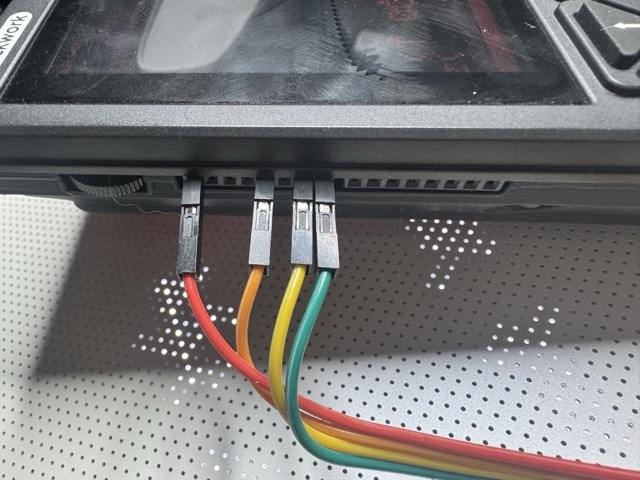
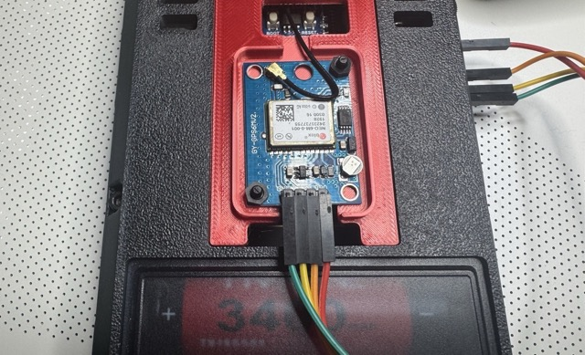
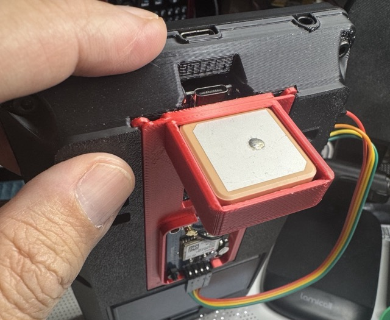

# GPS

GPS is an optional but welcome component to this build. The examples in this code use a UART GPS on the PicoCalc's side GPIO port. Reminder: GPIO pin numbering on ESP32 and on RP2040 Pico may differ, but the Waveshare mapping with the PicoCalc works.

## Wiring

On the PicoCalc's **"Core GPIOs" side header** (the 8-pin one labeled `3V3 OUT | GP2 | GP3 | GP4 | GP5 | GP21 | GP28 | GND`, counting top to bottom), GPS uses **four** of the eight pins:

| Header position | Label | GPS wire |
|---|---|---|
| 1 (top) | **3V3 OUT** | VCC |
| 5 | **GP5** | RX *(optional)* |
| 7 | **GP28** | TX |
| 8 (bottom) | **GND** | GND |

So the two data pins are **GP28** (the GPS's TX > the ESP32's receive) and **GP5** (the GPS's RX > the ESP32's transmit). Note the crossover: GPS **TX goes to GP28**, GPS **RX goes to GP5**.

- **GP5 (RX) is optional**: a NEO-6M streams position without being sent anything, so a 3-wire hookup (VCC, GND, GPS TX > GP28) is enough. You only need GP5 if you want to send the module configuration commands.
- Those are the **Pico GP numbers silkscreened on the header**, not the ESP32's GPIO numbers.

## Module and mounting

This GPS is an off-the-shelf NEO-6M module which cost $12 for two, including two ceramic antennas. For GPS use mounted to the PicoCalc, I suggest using [n602's "Replacement bottom part for PicoCalc" model](https://www.thingiverse.com/thing:6998636) and adapting the back cover to your needs. You do not want to sandwich your Pico between two full-cover boards (you're already losing a lot of reception thanks to the LCD in front) so try to make your design give the ESP32 plenty of space to collect WiFi/Bluetooth signals.

The model shown in my pictures and video is a mashup of n602's bottom door and [doppiozero's NEO 6M gps case](https://www.printables.com/model/105816-gps-ublox-neo-6m-case) on Printables.

## Photos

